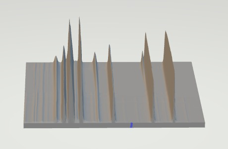
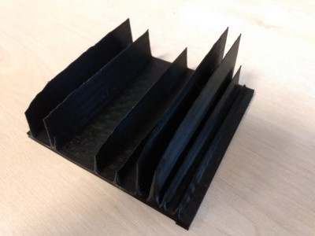

# NMRtoSTL

Converts 2D NMR data to an STL file for 3D printing.

Inspired by https://doi.org/10.1021/acs.jchemed.0c01130 and https://doi.org/10.1002/cmr.a.21470

 

3d model created with `python -m NMRtoSTL --stack 180 --sigma 1 10 -t 0.5 $NMR_DIRECTORY`

# Installation

Installation can be done using the setup.py by cloning the project:
`git clone https://github.com/DeemoONeill/NMRtoSTL/`
cd into the directory `cd NMRtoSTL` then run `python setup.py install`
this will install to the current active python environment.

# Use

1. Find the folder where you NMR data is saved. Currently supported formats are:

- Bruker 1D processed data (1r) [minimum 3 spectra]
- Bruker 2D processed data (2rr)
- NMRpipe 2D processed data (.ft2)

2. Find the filepath to the data you wish to use. In the case of Bruker data,
   the file path of the parent folder containing the 'fid' file should be used.

3. Run `python -m NMRtoSTL -o <youroutputfileName> <yourFilePath>` from your
   command line and it will output an STL file with the given name and location.

## Commandline arguments

A number of options are supported in the commandline arguments each have
sensible defaults allowing the script to be run as above or customised in size,
thickness, smoothing and min,max values for both axes. Example:

`python -m NMRtoSTL -v --f1 0 9 -S 1 10 --size 10 10 6 -t 0.5 -T 0.01 -o my3dNMR.stl path/to/nmrdata/`

- -o, --outfile TEXT filename and location for the output file `-o <outputfile>.stl` or `--outfile <outputfile>.stl`
- --f1 FLOAT... min and max values for f1 passed in together
  `--f1 0 9`
- --f2 FLOAT... min and max values for f2 passed in together `--f2 0 9`
- --f1min FLOAT Minimum value on the f1 axis `--f1min 0`
- --f1max FLOAT Maximum value on the f1 axis `--f1max 9`
- --f2min FLOAT Minimum value on the f2 axis `--f2min 0`
- --f2max FLOAT Maximum value on the f2 axis `--f2max 9`
- -s, --stack INTEGER Number of 1D spectra to stack together `-s 200` or `--stack 200`
- -S, --sigma INTEGER... sigma : pair of ints, optional Sigma values for x
  and y axis to use for gaussian smoothing of peaks.
  The default is (0,0)
- -z, --size FLOAT... X, Y and Z dimensions of final mesh (in mm). The
  default is (5, 5, 5).
- -t, --thickness FLOAT Thickness of the base (in mm)
- -T, --threshold FLOAT Threshold to remove noise from baseline as a
  fraction of the height of the tallest peak. The
  default is 0.
- -v, --verbose
- --help Show these options

# Features to add

- [x] X and Y limits
- [ ] read from generic files (in progress)
- [x] reduce number of mesh points
- [x] add arguments for limits, size, stacking, smoothing and threshold to command line input

# Known issues

- Read from Agilent/Varian data still work in progress.
- Fusion 360 reports errors: 'Mesh is not closed' and 'Mesh does not have a positive volume' with the .stl file. The current workaround is to run mesh repair with the 'wrap' option in Fusion.

# Contributers

- Matthew O'Neill
- Andrew Hall
